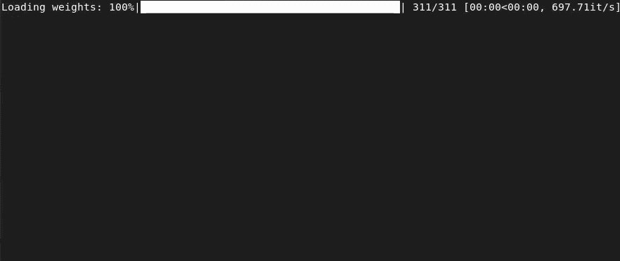

*This project has been created as part of the 42 curriculum by psewasti.*

# Call Me Maybe: Introduction to Function Calling in LLMs



## Description

This project implements function calling using constrained decoding with LLMs to provide
a structured, machine-readable output.

The program accepts a list of function definitions and a list of prompts and outputs a JSON
file containing the functions selected by the LLM and their arguments.

## Instructions

### Installation

To install the project dependencies, ensure you have `uv` installed and run:

```bash
make install
```

### Execution

Run the program using the following command:

```bash
make run
```

By default, the program reads from `data/input/` and writes to `data/output/`.

### Other Commands

The `Makefile` also provides rules for maintenance and quality control:

- `make lint`: Run `flake8` and `mypy` for static analysis and type checking.
- `make clean`: Remove temporary files, caches, and `__pycache__` directories.
- `make debug`: Launch the program using the Python debugger (`pdb`).

### Available Flags

You can customize the program's behavior using the following command-line flags:

- `--functions_definition <path>`: Path to the JSON file containing function definitions (default:
  `data/input/functions_definition.json`).
- `--input <path>`: Path to the JSON file containing input prompts (default:
  `data/input/function_calling_tests.json`).
- `--output <path>`: Path to the JSON file where results will be saved (default:
  `data/output/function_calling_results.json`).
- `--model <name>`: The name of the LLM model to use (default: `Qwen/Qwen3-0.6B`).

Example with flags:

```bash
uv run python -m src --input data/input/function_calling_tests.json --output data/output/function_calling_results.json
```

### Models

The system is designed to work with various LLMs. While **Qwen/Qwen3-0.6B** is the default model,
you can run the program with other models. However, only the models included in the `Makefile` have
been tested:

- `make run` (Qwen/Qwen3-0.6B)
- `make run-smol` (HuggingFaceTB/SmolLM2-1.7B-Instruct)
- `make run-smoller` (HuggingFaceTB/SmolLM2-360M-Instruct)
- `make run-liquid` (LiquidAI/LFM2.5-1.2B-Instruct)
- `make run-llama` (meta-llama/Llama-3.2-1B-Instruct)

## Algorithm Explanation and Design Decisions

This project implements constrained decoding using a finite-state machine (FSM) that enforces both
JSON syntax and the expected schema derived from the provided `functions_definition.json`.

### High-level Flow

- **Build prompt**: The `Robot` composes a system/user prompt followed by a JSON scaffold starting
  with `{`, the `"prompt"` field, and the `"name"` field.
- **Token loop**: The prompt is encoded, and then one token is generated at a time. After each
  token, the partial answer is validated by the FSM.
- **Constrained decoding**: If a candidate token makes the partial output invalid, it is rejected
  and replaced with the next-best token. This process continues until a valid token is found.
- **Stop condition**: When the FSM signals that a full JSON is complete, generation stops and the
  answer is returned.

### Source of Constraints

- **JSON Structure**: The FSM contains states and transitions for JSON punctuation and whitespace,
  guaranteeing well-formed objects, arrays, strings, numbers, booleans, and null.
- **Schema Compliance**: Using function definitions, the FSM restricts:
    - The `"name"` field to one of the allowed function names.
    - The `"parameters"` object to exactly the allowed keys for the chosen function.
    - Each parameter’s type (number/integer/string/boolean).
- **No Extra Keys**: Transitions only exist for permitted keys, preventing additional fields.

### Logits Masking Implementation

- The model produces logits for the next token.
- The best available token is picked and unconditionally appended to the output.
- The FSM validates the resulting partial string:
    - **OK**: keep the token and continue.
    - **FINISHED**: the JSON is complete; stop and return.
    - **INVALID**: set the chosen token’s logit to `-inf`, remove it from output, and try
      the next best token. This loop implements logits masking via rejection of invalid tokens.

### Autocomplete for structure

- Before sampling, autocompletion is attempted when there is only one valid transition in the FSM.
  This reduces the number of tokens generated by the model and improves performance.
- After autocompletion is done (if any), the last token is removed from the output and generation
  resumes from there. This is done because LLMs have their own way to tokenize text; without this
  step, quality of output drops significantly. This technique is called `Token Healing`.

### Determinism and Performance

- The program always selects the token with the highest logit, ensuring deterministic output.
- Constrained decoding is performed only after appending a token; this is more efficient than
  proactively masking the entire vocabulary over the logits list.

### Error Handling and Reliability

- If a model provided by the user is not supported, the program automatically falls back to
  `Qwen/Qwen3-0.6B`.
- Input files are validated up-front; all runtime errors are handled gracefully to avoid crashes.

## Performance Analysis (using a default model and provided tests)

Accuracy: 100%

Reliability: 100%

Speed (on 42 machine):

- GPU: ~25s
- CPU: ~155s

## Challenges Faced

- **Generation Speed**: Generating every single character of a JSON structure (like braces, quotes,
  and keys) can be slow. To address this, **autocompletion** is implemented for deterministic parts
  of the FSM, reducing the number of tokens the model needs to generate.
- **Structural Constraints**: Small LLMs often struggle to maintain valid JSON syntax and schema
  compliance. This is solved by using a **Finite State Machine (FSM)** that masks out invalid tokens
  at each step.
- **Degraded Quality with Autocompletion**: I observed that autocompletion sometimes
  confuses the model, leading to lower quality in the following tokens. To fix this,
  the **last token is removed** after each autocompletion sequence, allowing the LLM to "re-anchor"
  itself by generating the final token of the sequence naturally.

## Testing Strategy

The project is validated using both automated and manual tests:

- **Automated Tests**: Run `pytest tests` to execute the full suite, including FSM validation,
  schema enforcement, and fuzzing tests.
- **Manual Verification**: Output accuracy is verified by inspecting
  `data/output/function_calling_results.json` against the input prompts to ensure logical
  correctness.

## Resources

- [Don't Fine-Tune, Decode: Syntax Error-Free Tool Use via Constrained Decoding](https://arxiv.org/abs/2310.07075) –
  article describing function calling with constrained decoding.
- [Interegular](https://pypi.org/project/interegular/) – inspiration for the FSM implementation.
- [Guidance](https://guidance.readthedocs.io/en/latest/example_notebooks/tutorials/token_healing.html) –
  explanation of token healing.

### AI Usage

AI was used mainly as an advisor during the project, to get suggestions on how to implement certain
features and to get opinion on design ideas. It was also used to find inconsistencies in the code
and to suggest improvements.
AI wrote no significant part of the program.

## Example Usage

1. **Prepare Input Data**: Place your function definitions and test prompts in the `data/input/`
   directory. (Example files are already included in the repository).
2. **Install Dependencies**:
   ```bash
   make install
   ```
3. **Run the Program**:
   ```bash
   make run
   ```
